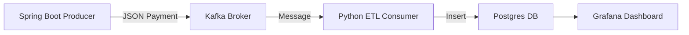

# 🏦 Payment ETL Application

---

## 🌐 Visão Geral

Essa aplicação demonstra um **pipeline de pagamentos em tempo real**, integrando:

- **Spring Boot Producer** → gera pagamentos e publica no Kafka  
- **Kafka** → mensageria confiável  
- **ETL Python** → consome Kafka, converte datas para UTC e insere no Postgres  
- **Postgres** → armazena os pagamentos  
- **Grafana** → dashboards e métricas

O fluxo garante **consistência de dados, escalabilidade e observabilidade**.

---

## 🏗 Arquitetura

## 🛠 Tecnologias

| Componente | Tecnologia  | Ícone                                                                                         |
| ---------- | ----------- | --------------------------------------------------------------------------------------------- |
| Producer   | Spring Boot |  |
| Broker     | Kafka       |      |
| ETL        | Python      |        |
| Banco      | PostgreSQL  |    |
| Dashboards | Grafana     |          |
| Contêiner  | Docker      |      |

